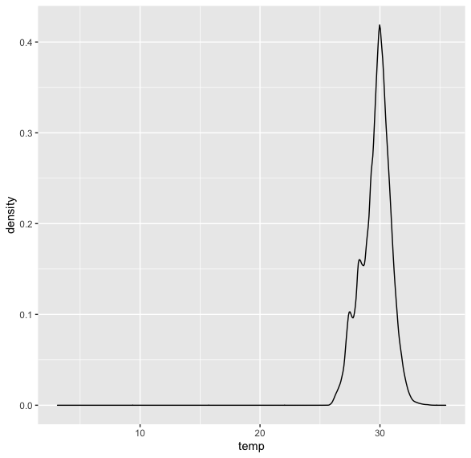
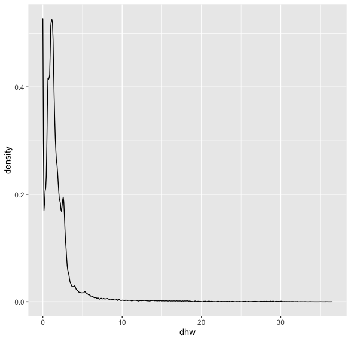
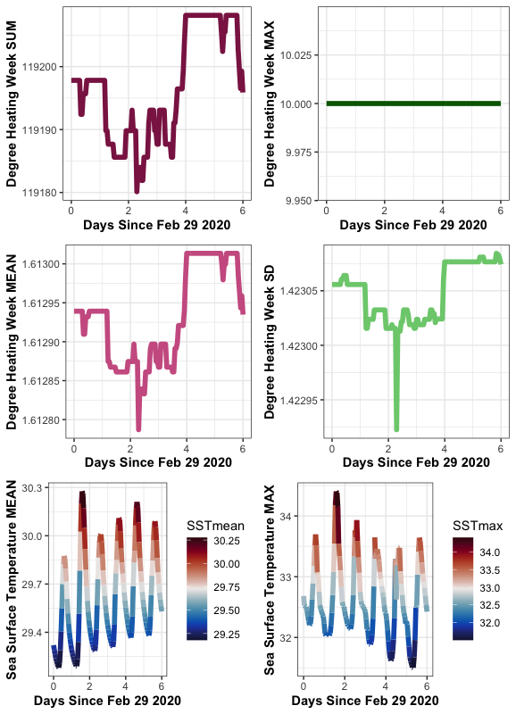
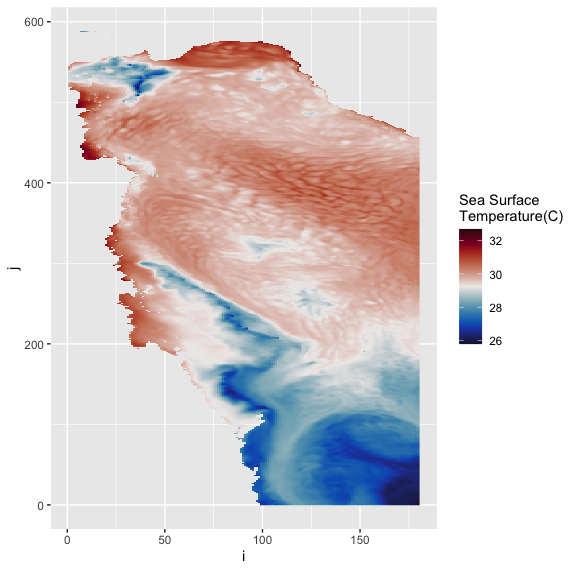
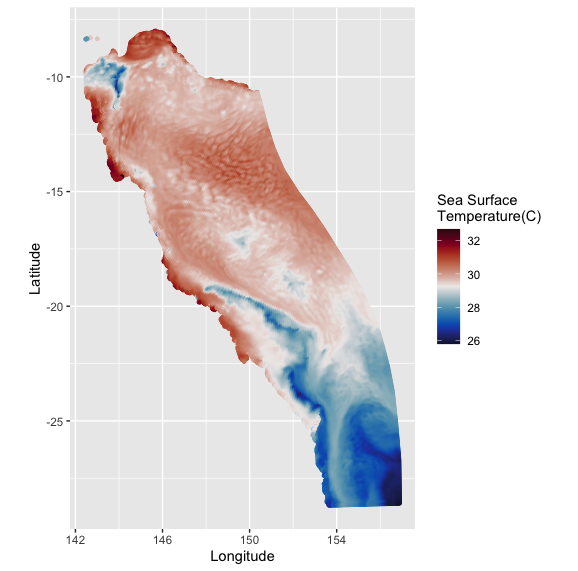
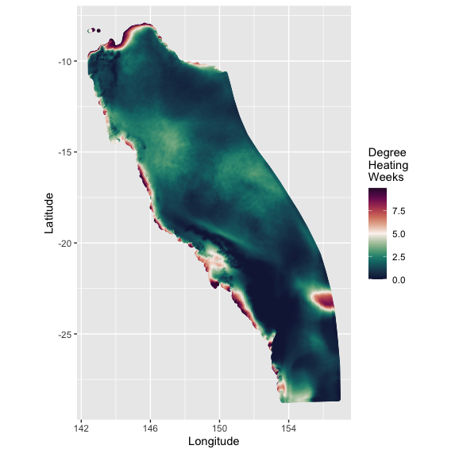

# Introduction

My Name is Derek Fulton, I'm a research assistant (and apprentice goat herd) and I live and work in Tasmaina. I'm a self-taught 3D generalist (animator) and for the last eight years, since returning to the work force after raising three children and supporting my wife in her career, I have been making animations and graphics to help scienctists communicate their science. 

# My Project

This isn't the usual project you might expect to see here. I'm not a scientist. I have no research, or question, relevant to a problem to answer. But after spending all night with a collaegue constructing an image sequence of heat maps of sea surface temperatures of the oceans surrounding Australia, to go into an animation for a news clip, I thought there had to be a better way. I was right. Next morning it was explained to me that an R script could have automated this task, it would have been completed much, much, faster.

So what I have here in this script is my journey. A process that begins with being handed data, looking at it and muttering 'what dark sorcery is this?' Then finding out (a little bit).    

## Preliminary results?!

Move along. Nothing to see here. Are you one of those people who read the end of the story first? Follow along to see what happens next (or scroll to the bottom of the page if you must).

## The Script

Here we see the start of the script, the data (gbr4_simple_2020-03.nc, weighing in at 5.2 GB) used is from ereefs and involves 21975620 observations over a period of 6 days from Feb 29 2020. There was no reason to choose this particular data set, it was simply the luck of the draw. Indeed I had to subset it to just the surface layer because the full vertycal 3D time series is 47x larger and too large for R to deal with.

Prior to the process of reading in the data, I was engaged in a conversation with my (dragooned) 'live-in, work from home because we are social distancing mentor', about what I might expect to see in the data set and how I might explore it. After the discussion the decision was made that with the time avaliable I would need to restrict myself to the surface layer and look at temperature and dhw (degree heating week, an indicator of coral bleaching) over time.  

```{r, eval=F, echo=T}

rm(list=ls()) # clear out enviroment, good practice.

setwd("/Users/ful08h/Documents/Data_School/Data_school_project/") # Set working directory where data is stored.
   
library(tidyverse)  # load tidyverse library
library(tidync)     # load tidync library
library(dplyr)      # load dplyr library
library(ggplot2)    # ggplot library
library(pals)       # load pals library (palettes)
library(gridExtra)  # load gridextra library
library(gganimate)  # load gganimate library

# Assume entire grid active

sstdata <- tidync('gbr4_simple_2020-03.nc') %>%
  hyper_filter(k = between(k, 46, 47)) %>%    # subsetting to just the two surface layers.
  hyper_tibble(select_var = c("temp", "dhw")) # from the subset, create a tibble only of variables 'temp' and 'dhw'

# Subset to D1, D2 active and merge into one data frame.

sstdata2D <- tidync('gbr4_simple_2020-03.nc') %>% 
  activate('D1,D2') %>% 
  hyper_tibble(select_var = c('latitude', 'longitude'))
sstDataCombo <- merge(sstdata, sstdata2D, by=c('i','j'))
```

The first challenge I faced was the size of the data. Initially I intended to use the nCDF4 package to read in the data, but in attempting to do so I ran out of memory. After a number of questions and a google search I loaded up the tidync package. This is more in line with the tidyverse approach and it moer easily allowed me to subset the data. No data is read until explicitly requested, as a data frame or list of arrays via hyper_tibble() or hyper_array().

```{r, eval=F, echo=T}
# To choose the palettes you need to see the density of the data distribution to see natural break points.

sstdata_surf <- filter(sstDataCombo, k == 47) #filter the tibble to the surface layer and all the time steps.

ggplot(sstdata_surf, aes(x = temp)) + 
  geom_density()
```

```{r, eval=F, echo=T}
# based on the plot above I don't need to examine values less than 25.

ggplot(sstdata_surf, aes(x = dhw)) + 
  geom_density()

# based on this plot I don't need numbers more than 10. Masking the outliner values allows
# greater focus on the most dense data points.
```


Deciding on what data to mask also helped in the decision on how to most effectivetly use which palette. I recently read a paper 'Visualizing Science: How Color Determines What We See' - https://eos.org/features/visualizing-science-how-color-determines-what-we-see. One of the points discussed in this paper was desaturating part of the colour gradient palette to focus attention. 

```{r, eval=F, echo=T}
# look at the properties through time.

sstdata_mask <- sstdata_surf %>% 
  filter(between(dhw, 0, 10), between(temp, 25, 40)) #filter the dhw to meaningful values and temperature to values off Qld

# Get summary statistics.

sstdata_dhwSum <- sstdata_mask %>% 
  group_by(time) %>% 
  dplyr::summarise(dhwSum = sum(dhw), dhwMax = max(dhw), dhwMean = mean(dhw), dhwSD = sd(dhw), SSTmean = mean(temp), SSTmax = max(temp))
sstdata_dhwSum$NewTime <- sstdata_dhwSum$time - min(sstdata_dhwSum$time)

# Plot the different summary statistics - turns out dhw is boring so do max SST (SST as well as short for 'sea surface temperature'
# also is short for 'Starship Troopers').

p1 <- ggplot(sstdata_dhwSum, aes(x = NewTime, y = dhwSum)) +
  geom_line(size = 2, colour = 'violetred4') +
  labs(x = 'Days Since Feb 29 2020', y = 'Degree Heating Week SUM') + 
  theme_bw() + theme(axis.title = element_text(face = 'bold'))

p2 <- ggplot(sstdata_dhwSum, aes(x = NewTime, y = dhwMax)) +
  geom_line(size = 2, colour = 'darkgreen') +
  labs(x = 'Days Since Feb 29 2020', y = 'Degree Heating Week MAX') + 
  theme_bw() + theme(axis.title = element_text(face = 'bold'))

p3 <- ggplot(sstdata_dhwSum, aes(x = NewTime, y = dhwMean)) +
  geom_line(size = 2, colour = 'hotpink3') +
  labs(x = 'Days Since Feb 29 2020', y = 'Degree Heating Week MEAN') + 
  theme_bw() + theme(axis.title = element_text(face = 'bold'))

p4 <- ggplot(sstdata_dhwSum, aes(x = NewTime, y = dhwSD)) +
  geom_line(size = 2, colour = 'palegreen3') +
  labs(x = 'Days Since Feb 29 2020', y = 'Degree Heating Week SD') + 
  theme_bw() + theme(axis.title = element_text(face = 'bold'))

p5 <- ggplot(sstdata_dhwSum, aes(x = NewTime, y = SSTmean, colour = SSTmean)) +
  geom_line(size = 2) +
  scale_colour_gradientn(colours = ocean.balance(100)) +
  labs(x = 'Days Since Feb 29 2020', y = 'Sea Surface Temperature MEAN') + 
  theme_bw() + theme(axis.title = element_text(face = 'bold'))

p6 <- ggplot(sstdata_dhwSum, aes(x = NewTime, y = SSTmax, colour = SSTmax)) +
  geom_line(size = 2) +
  scale_colour_gradientn(colours = ocean.balance(100)) +
  labs(x = 'Days Since Feb 29 2020', y = 'Sea Surface Temperature MAX') + 
  theme_bw() + theme(axis.title = element_text(face = 'bold'))

grid.arrange(p1, p2, p3, p4, p5, p6, nrow = 3)
```

```{r, eval=F, echo=T}
# SSTMax is interesting, time to draw some maps.

# Plot 1  - Plot a single time stamp on plan unprojected model grid.

sstdata_sub <- filter(sstdata_mask, time == 11017)     # filter the tibble to single timestep.
imax <- max(sstdata$i)                                 # this line finds the largest value of 'i' and assigns it to the variable 'imax'.
sstdata_sub$yinvert <- imax - sstdata_sub$i            # take imax minus i and assign it to the variable yinvert. otherwise the plot will be upside down.
ggplot(sstdata_sub, aes(x=j, y=yinvert, fill=temp)) + 
  geom_raster() +
  scale_fill_gradientn(colours = ocean.balance(100)) +
  labs(x = 'i', y = 'j', fill = 'Sea Surface\nTemperature(C)')
```

```{r, eval=F, echo=T}
# Plot 2 - Or more appropiately using latitude and longitude.

ggplot(sstdata_sub, aes(x = longitude, latitude, colour = temp)) +
  geom_point(size = 1, alpha = 1) +
  scale_colour_gradientn(colours = ocean.balance(100)) +
  labs(x = 'Longitude', y = 'Latitude', colour = 'Sea Surface\nTemperature(C)') +
  coord_quickmap()
```

```{r, eval=F, echo=T}
# Plot of dhw

ggplot(sstdata_sub, aes(x = longitude, latitude, colour = dhw)) +
  geom_point(size = 1, alpha = 1) +
  scale_colour_gradientn(colours = ocean.curl(100)) +
  labs(x = 'Longitude', y = 'Latitude', colour = 'Degree\nHeating\nWeeks') +
  coord_quickmap()
```

```{r, eval=F, echo=T}
# Do the animation of the SSTMax over time.

anim_SSTMaxOverTime <- ggplot(sstdata_mask, aes(x = longitude, latitude, colour = temp)) +
  geom_point(size = 1, alpha = 1) +
  scale_colour_gradientn(colours = ocean.balance(100)) +
  labs(x = 'Longitude', y = 'Latitude', colour = 'Sea Surface\nTemperature(C)') +
  coord_quickmap() +
  transition_states(time)

animate(anim_SSTMaxOverTime, nframes = 300, fps = 30, renderer = file_renderer(prefix = 'SSTMaxOverTime'))   # export anim_SSTMaxOverTime as a image sequence.

animate(anim_SSTMaxOverTime, nframes = 300, fps = 30, renderer = gifski_renderer(), width = 578, height = 571) #export anim_SSTMaxOverTime as a gif

anim_save("SSTMaxOverTime.gif")  
```

I choose to render the animation two ways, both took a long time to process and I'll discuss both starting with the second, gifski_render(). This is the default render for animate() and what it will use unless told otherwise. It provided a 14.3 MB animated gif file. Not entirely suitable to share or publish.

The first method was to use file_render() to produce a sequence of image files in PNG format, not an animation, but in fact the first step to building an animation. For me this is great as it allows me to add flourishes not possible in R (and is an ideal outcome from the course for me!). I imported the sequence into a Blender, an open source 3D creation suite I use. I used the video editing functions to overlay a Queensland coastline I had handy for reference and rendered a movie in mp4 format. The resulting file was only 766.6 KB in size and it's embedded here.

```{r iframe_video, include=FALSE}
video_path  <- "resources/"
video_files <- list.files(video_path,
                         pattern = "\\.mp4$",
                         recursive = TRUE,
                         all.files = FALSE,
                         full.names = TRUE)
```

<iframe width="571" height="578" src="resources/SSTMaxOverTimeMovie0001-0300.mp4" align="middle" frameborder="0" allowfullscreen></iframe>

**Sea Surface Temperature over Time**

For me this one is prefered of the two methods, first the result is much smaller, easier to share, publish or use in a presentation and it allows me to add in the artistic components that are central to my job.

# My Digital Toolbox

* R - dplyr, ggplot, tidyverse, tidync, ggplot2, pals, gridExtra, gganimate.
* Blender

# Next steps

As it turns out I now have a method to effiecently produce a image sequence of heat maps I can use as a component in an animation.

To be honest what I did was a quick and dirty method. You see I didn't actually plot a map, I used a visual trick to make you think I did. The geom_raster() function seems to be fine for a single image but it disgreed with the transition_states() function, the animated graph instead uses geom_point(). It's actually a scatter plot with the point size aliased for pixelsize to trick the eye into seeing it as a continuous map. So what I would like to learn now is how to properly project a map in R, and match the coastline up smoothly. 

Also there are other little niceties, such as adding a timestamp (which would be helpful to the person viewing the file), so lots more to touch up. 

# My Data School Experience

My Data School experience has been positive, I enjoyed interacting with both the instructors, helpers and students. Not only did I learn a little bit about R but also gained a appreaciation for the workflow of other CSIRO staff members. 
