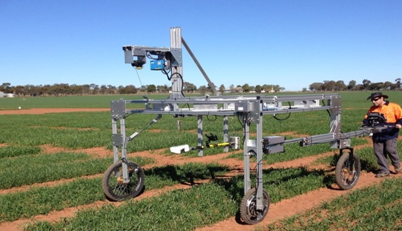
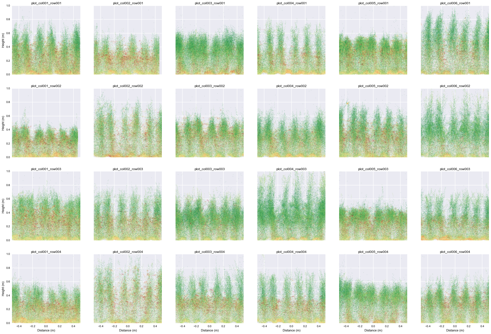

```{r setup, include=FALSE}
knitr::opts_chunk$set(
  results = 'asis',
  echo = FALSE,
  warning = FALSE,
  message = FALSE,
  fig.align = 'center'
)

#Load libraries
library(tidyverse)
library(gapminder)
library(kableExtra)
library(cowplot)
```


# Introduction
I am a research geneticist with a background in quantitative and statistical genetics. My research interest is in understanding the architecture of genetically-complex traits key to improving the water-limited adaptation of rainfed crops. My passion is in delivering these genetics to commercial breeding programs in the development of new and improved crop varieties for use by growers.

I am competent in programming in statistics packages (e.g. SAS and ASReml) but was an 'R-numpty' (actually still am..!) I see tremendous value in use of R in data-cleaning and storage leading to statistical analysis. Of course, quality analysis relies on an optimal experimental design focussing on the null hpotheses, and then collection of, and interpretation of, quality data. Together, these activities represent around 90% of the experimental process in my research projects. That said, poor and untidy data can significantly lessen the time that can be devoted to the science driving the research and its delivery.

# My Project
The expression of genetically-complex traits reflects the combined effects of many genes and how they interact with the environment to produce a 'phenotype'. Breeders use genomic and phenotypic information from across large breeding populations hoping to identify that optimal combination of genes that will provide a new variety with greater yield at lower cost to a grower. CSIRO's role is to provide support in identifying new traits (and their underlying genetics), and the tools to aid in their cost-effective assessment often across many '000s of breeding lines.

One key trait for improving yield under drought is the rapid development of leaf area to: (1) shade the soil and reduce water loss through evaporation; and (2) maximise the the biomass needed to increase yield potential. Reducing the cost of phenotyping per family allows for more families to be assessed, and more environments to be sampled to arrive at a more accurate genotype value for the family and the wider population from which the line was derived. Cheap and inexpensive sensors offer potential for rapid, low-cost screening but their value is not well understood. This project summarises longtitudinal data collected over time ('growth or development stages') for a representative set of diverse wheats measured using a Greenseeker unit (ie. Normalised Difference Vegetation Index or 'NDVI') and Light Detection and Ranging ('LiDAR') mounted on a portable Phenomobile. Plots were then ground-truthed with plots cuts of actual measurements of crop biomass.


## Prediction is contingent on stage of crop development
The data highlights large genotypic variation within each developmental growth stage for crop biomass, NDVI and LiDAR scores (Figures 1 and 2). Relationships were strong between crop biomass and LiDAR score (r2 = 0.70 to 0.82, P<0.01), and too a lesser extent with biomass and NDVI (r2 = 0.23 to 0.56, P<0.05). Importantly, the slope for the relationship of biomass and NDVI changed with development stage (b = 2.5 to 11.5)(Figure 1) whereas the slopes for biomass and LiDAR score were relatively unchanged (b = 1.48 to 1.88)(Figure 2). This suggests prediction of biomass in diverse wheat breeding populations may be more reliably predicted with LiDAR than with the more commonplace and 'off-the-shelf' NDVI GreenSeeker (NDVI) hyperspectral units.   


**Field data**

```{r include=FALSE}

table.phenomics <- read_csv("data/phenomics.csv")

```

```{r mytable, echo=FALSE, out.width='100%'}

knitr::kable(head(table.phenomics, n = 6), format = "html", caption = "Crop biomass, development scores and high-throughput phenotyping surrogates") %>% 
  kable_styling("striped")
```

**So what is a Phenomobile (L) and what does output from LiDAR (R) look like?**

{width=450px}
{width=400px}

**Summary plots of NDVI and LiDAR score versus biomass for different growth stages from R**

```{r standard-plot, out.width='60%', fig.align='center', fig.height= 4, fig.width=6, fig.cap="Biomass - high-throughput phenotyping plots"}


phenomics <- read_csv("data/phenomics.csv") #load data


phenomics <-rename(phenomics, `Growth Stage` = Deve_stage)


plot1 <-ggplot(data = phenomics,
  mapping = aes(x = NDVI, y = Biomass, colour = `Growth Stage`)) +
  geom_point(aes(size=`Zscore`), shape=1) +
  stat_smooth(method = "lm", se = FALSE) +
  ylim(c(0,10)) + 
  xlim(c(0.4,0.9)) +
  ylab(bquote('Biomass (tonnes '* ha^-1*')')) +
  xlab("Normalised Difference Vegetative Index (NDVI)")

plot2 <-ggplot(data = phenomics,
  mapping = aes(x = LiDAR, y = Biomass, colour = `Growth Stage`)) +
  geom_point(aes(size=`Zscore`), shape=1) +
  stat_smooth(method = "lm", se = FALSE) +
  ylim(c(0,10)) + 
  xlim(c(0,3)) +
  ylab(bquote('Biomass (tonnes '* ha^-1*')')) +
  xlab("LiDAR Score")
```

```{r figure, out.width='100%', fig.align='center', fig.height= 6, fig.width=14, fig.cap="NDVI vs Crop biomass across diverse wheat genotypes;       Figure 2: LiDAR Score versus Crop biomass across diverse wheat genotypes"}


plot_grid(plot1, plot2,
          nrow = 1,
          ncol = 2,
          labels = "auto", label_size = 20)

```


# My digital toolbox

I have found it difficult to move away from Excel but will continue trying to engage R for data manipulation. Once data is inputted into R, I've been an avid user (and supporter) of tidyverse and ggplot. Without question the function I most liked in R was ggplot. A very flexible package that allows relationships to be viewed quickly and efficiently

{.pull-right width=100px}


# My time went ...

Plenty of time and effort in getting formatting right (still not 100% happy!) In this project it was editing to the constraints and confines of the poster that were most challenging. Understanding how to position images and text took time and patience......

# Next steps...

I am very keen to commit to ongoing use of R in data checking and delivery of summary statistics. I am hoping to advance to more complex statistical analysis including multienvironment analysis (METs) and covariance analysis including multivariate modelling. I'm really keen to see what a biplot looks lke in R!!

# My Data School Experience

My DataSchool experience was awesome. A huge 'thank you' to Kristian, Stephen and Karensa! Thanks also to Peter Watkins for his help and valued CSIRO-chat. Thanks also to the other helpers and to my DataSchool classmates.

I believe I have the minimal basics of R - enough to be really dangerous and build on the knowledge I have gleaned throughout the DataSchool training. I am growing in confidence and plan to 'maintain the rage'!!

** **

{width=400px}
{width=500px}